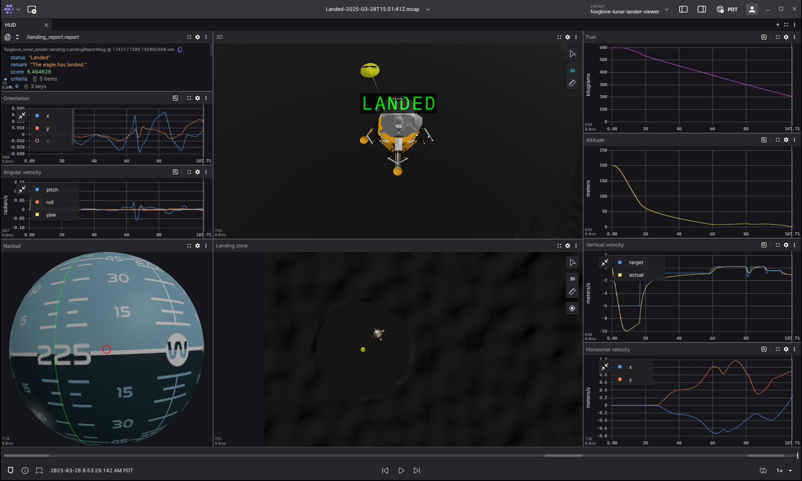

# Foxglove Lunar Lander Simulator

This is a lunar lander simulator that uses the Foxglove app as its UI.
The simulator is written against the [Foxglove
SDK](https://github.com/foxglove/foxglove-sdk), as a way to demo some of its
functionality.

In this game, you're piloting an Apollo lunar lander.



## Prerequisites

You'll want to use a gamepad for this.
I've tested with a PS4 controller, but anything with dual joysticks should be fine.

### Extensions

This game depends on some unreleased
[extensions](https://docs.foxglove.dev/docs/visualization/extensions/introduction).

- [Joystick](https://github.com/joshnewans/foxglove-joystick): Joystick controls
- [Foxglove Navball](https://github.com/gasmith/foxglove-navball): Attitude indicator

The joystick extension is publicly available in the extension registry, but
there are some very useful commits (e.g., to save state) since the last release.
It's worth installing from git.

To install these, clone the repos, open the Foxglove desktop app, and do:

```console
$ npm install
$ npm run local-install
```

### Layouts

You'll want to [import the following
layouts](https://docs.foxglove.dev/docs/visualization/layouts#import-and-export):

 - [foxglove-lunar-lander-live.json](layouts/foxglove-lunar-lander-live.json)
 - [foxglove-lunar-lander-viewer.json](layouts/foxglove-lunar-lander-viewer.json)

## Running the game

Run the game server on your local machine:

```console
$ cargo build
$ cargo run --release
```

In foxglove desktop, [open a live websocket
connection](https://docs.foxglove.dev/docs/connecting-to-data/frameworks/custom#connect)
to `ws://localhost:8765`, and use the `foxglove-lunar-lander-live` layout.

### Controls

You'll want a gamepad. If you're using a PS4 controller, the controls are:

- D-pad up/down: Tap to increase/decrease the target vertical velocity
- Left stick: Strafe using RCS boosters
- Right stick: Adjust pitch and roll using RCS boosters
- L2/R2: Hold to adjust yaw
- PS button: Start or reset

You might find that your controller's button mappings are different from mine.
If that's the case, you can write your own [`gamepad.json`](gamepad-ps4.json).
You can use the joystick panel's "Auto-generated" display to figure out which
indexes correspond to the physical axes and buttons that you want to use.

## Recorded games

Each game is exported to an MCAP recording in the local `recordings/` directory.
To view a recording, use the `foxglove-lunar-lander-viewer` layout.

If you want to automatically upload recording metadata to Foxglove after each
game, you can point the [Foxglove
agent](https://docs.foxglove.dev/docs/foxglove-agent/introduction) at your
recording directory.

At the moment, the lander model isn't stored in the recording; it's just a
reference to [`package://assets/apollo.dae`](assets/apollo.dae). You'll need to
[configure the ROS package path
accordingly](https://docs.foxglove.dev/docs/settings#desktop-app).

## Unfinished business

- Attitude control assistance
- Embed model data in the /lander channel
